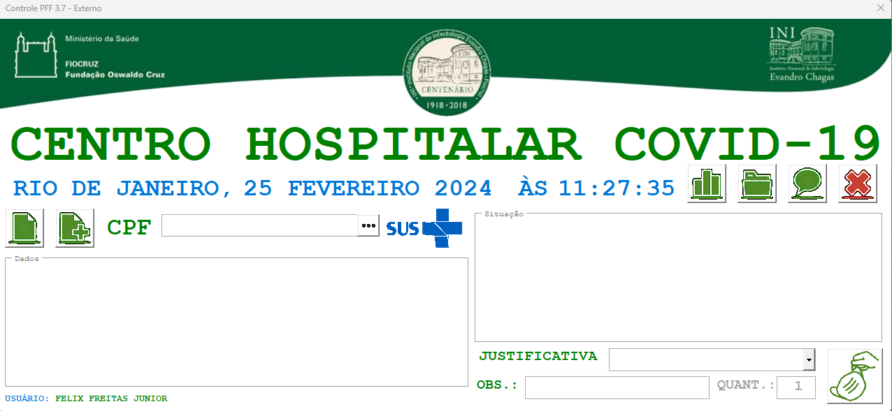

# CONTROLE-PFF-VBA

Sistema de controle de entrega e racionamento de máscaras N95 para profissionais de saúde, desenvolvido em Excel VBA durante a pandemia de COVID-19.

## 🏥 Sobre o Projeto

Este projeto nasceu de uma necessidade real no ambiente hospitalar durante o início da pandemia de COVID-19, quando as máscaras N95 estavam escassas. Desenvolvi esta solução para registrar, controlar e racionar a distribuição das máscaras entre os profissionais, garantindo equidade e segurança a todos.

Foi meu primeiro contato prático com programação. Com curiosidade, estudei VBA e criei as automações a partir do zero.

## ✨ Funcionalidades

- **Cadastro de profissionais:** Registra CPF, nome, setor e função.
- **Controle de retiradas:** Consulta e registra cada retirada de máscara, com data, horário e profissional responsável.
- **Gestão de prazos:** Calcula automaticamente se o profissional já pode receber uma nova máscara, com base na última retirada.
- **Atualização de dados:** Permite edição e atualização de informações dos profissionais.
- **Interface via formulários VBA:** Tudo integrado à planilha Excel.
- **Facilidade de uso:** Basta abrir o arquivo Excel e habilitar macros.

## 💡 Tecnologias Utilizadas

- Microsoft Excel
- VBA (Visual Basic for Applications)

## 📁 Estrutura Recomendada de Pastas

Sugestão de organização para facilitar o entendimento:

```
CONTROLE-PFF-VBA/
├── docs/              # Documentação, prints, histórico, relatos de uso
├── planilha/          # Arquivo(s) .xlsm principal(is)
├── vba/               # Módulos ou trechos de código VBA exportados (.bas, .frm, .cls)
├── exemplos/          # Exemplos de uso, dados fictícios ou templates
└── README.md
```

> **Dica:** Com o tempo, tente exportar os módulos VBA do Excel para a pasta `/vba` para facilitar o versionamento e leitura do código.

## 🚀 Como Usar

1. Baixe ou clone este repositório.
2. Abra o arquivo `.xlsm` em Microsoft Excel.
3. Habilite as macros para pleno funcionamento.
4. Siga as instruções nos formulários para cadastrar profissionais, registrar retiradas e consultar históricos.

## 👀 Exemplos de Tela



## 🙏 Agradecimentos

Agradeço aos colegas do hospital pela confiança e ao desafio que me motivou a aprender programação na prática.

## 📬 Contato

Fique à vontade para sugerir melhorias ou tirar dúvidas:

- [GitHub](https://github.com/FelixFreitasJr)
- [LinkedIn](https://www.linkedin.com/in/seu-linkedin) <!-- Substitua pelo seu LinkedIn -->

---

Feito com dedicação e curiosidade por **Felix Freitas Jr**